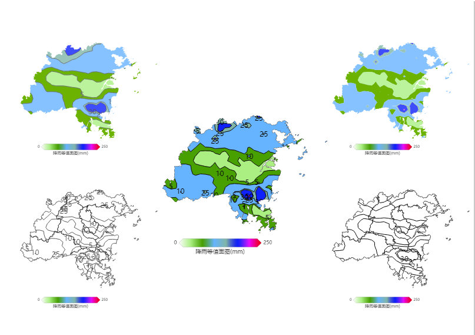
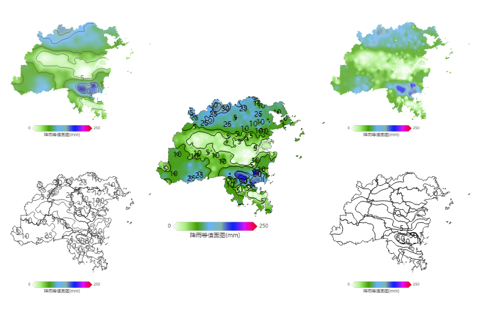
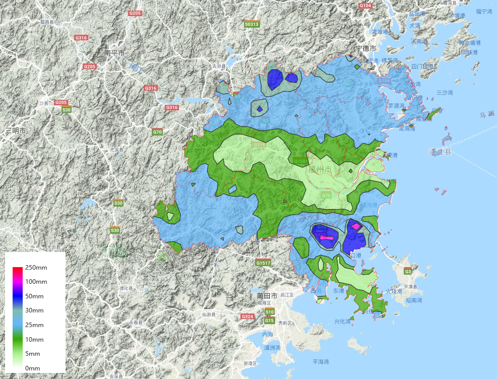

# iso-image
 * 等值面 等值线 生成
 * 支持渐变（除地图失量叠加）
 * 支持反距离平方权重法与克里金插值算法
 * 支持 worker 后台计算

## use
 [demo1](./dist/index.html)
 [demo2](./dist/map.html)

``` js
      npm install iso-image
      import IsoImage from 'iso-image'
      new IsoImage(data, option[, callBack])

      // or 

      <script src="./iso-image.js"></script>
      new IsoImage(data, option[, callBack])
```

 * option

|参数|类型|说明|
|----|----|----|
|type|Sting|idw(反距离平方权重法)/kriging(克里金插值)|
|pow|Number|idw 加权值|
|model|String|kriging 模型 (gaussian/exponential/spherical)|
|extent|Array|计算区域|
|clip|Array|裁剪边界|
|level|Array|色值等级|
|cellWidth|Number|计算精度|
|keyConfig|Object|data/clip 数据 key 配置|
|worker|String|worker 文件目录|
|smooth|Boolean|平滑(弃用)|

 * function

|方法|参数|说明|
|----|----|----|
|getIsosurface|fun(option)|获取等值面|
|getIsoline|fun(option)|获取等值线|
|getIsoImage|fun(option)|获取等值面等值线|
|getLegend|fun(option)|获取图例|
|layer|fun(option)|leaflet 绘制图层生成|
|drawIsosurface|fun(layer, option)|leaflet 绘制等值面|
|drawIsoline|fun(layer, option)|leaflet 绘制等值线|
|drawIsoImage|fun(layer, option)|leaflet 绘制等值面等值线|
|drawLegend|fun(layer, option)|leaflet 绘制图例|
|merge|fun(new IsoImage(), option, callBack)|多图合并|

#### worker 使用
 * 开启后台进程执行大量计算部分，防止js堵塞。
 * 下载 `./dist/worker` 文件夹， 参数 worker 路径配置为该文件夹路径。
 * 不支持 ie

#### 效果



